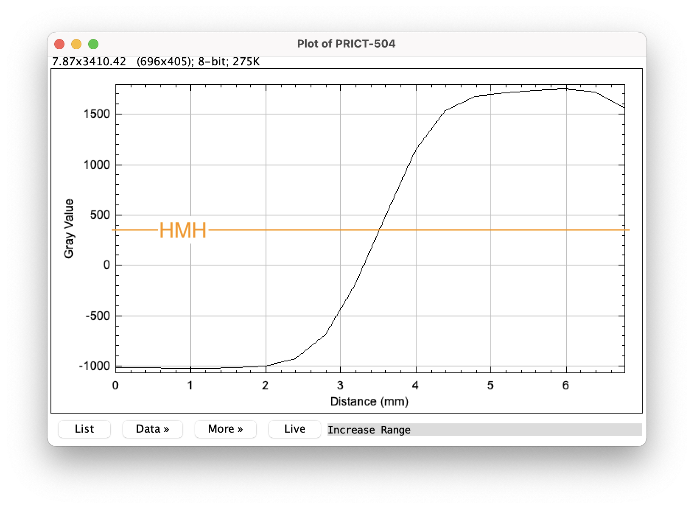
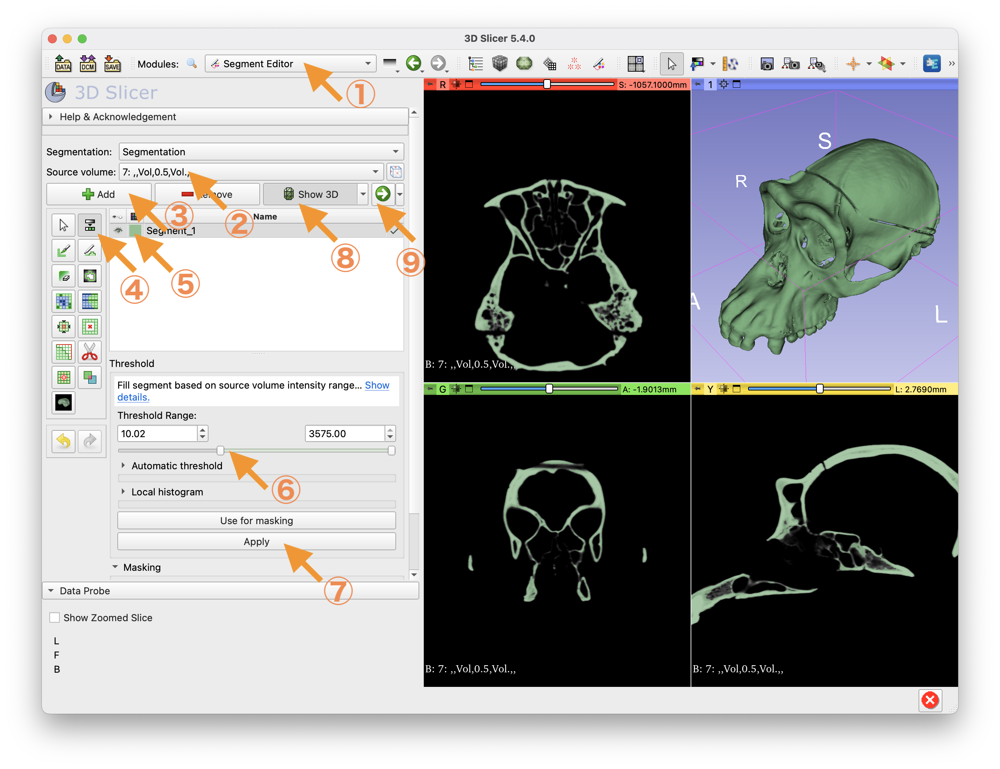

```{r setup, include=FALSE}
knitr::opts_chunk$set(echo = TRUE)
library(tidyverse)
library(geomorph)
library(ape)
```
2020-12-14作成  

`r Sys.Date()`更新

# はじめに

このドキュメントは、解剖学・骨学実習における計測・解析編の補足資料です。本実習では、霊長類の頭骨標本を使用し、形態計測、CT画像の処理、幾何学的形態測定を行います。これらの演習を通じて、基本的な技術の習得と関連概念の理解を目指します。

CT画像のセグメンテーションに特化した[発展編](https://github.com/itots/image_analysis_lecture/blob/main/image_analysis.ipynb)はこちら。

# 計測装置
## 装置の種類
- 標本に直接触れて計測する
  - ノギス
  - MicroScribe（Revware社）：三次元座標データを取得する装置

- 画像データを取得する装置（得られた画像データを用いて様々な計測を行う）
  - コンピュータ断層撮影 (CT)
  - 磁気共鳴画像（MRI）
  - 3Dスキャナ
  - デジタルカメラ

ノギス、MicroScribe、一部の3Dスキャナ、デジタルカメラは容易に持ち運びできるので、たとえば博物館を渡り歩いてたくさんのデータを収集するといったことができる。CTやMRIは大掛かりな装置を必要とするが、標本内部の構造を観察することができる。画像データは各種デジタルレポジトリでの整備・公開が進んでおり、世界中の研究者によって有効利用されている。

形態画像データを収録するデジタルレポジトリの例

- [Digital Morphology Museum, KUPRI](https://www2.ehub.kyoto-u.ac.jp/databases/printeg_view/printeg.php?db=prict)（2023年12月8日現在、セキュリティ上の問題により、外部からのアクセスは閉鎖されている）
- [MorphoSource](https://www.morphosource.org/)
- [MorphoMuseuM](https://morphomuseum.com/)

デジタルカメラで標本を撮像する場合は、視差によって生じる計測誤差に注意する必要がある。これは、標本とレンズの距離を近づけすぎないようにすること、カメラとレンズのセッティングをサンプル間で統一することなどにより、ある程度低減することができるようだ（Mullin & Taylor 2002）。

本実習では、ノギスとMicroScribeの計測を体験する。また、μCT（Bruker社製Skyscan 1275）の撮像を見学する（X線ガラスバッチを着用していない人はCT装置の操作はできない。自分で操作する場合は、事前に所定の講習を受けて登録する必要がある）。

# CTの仕組み

CTは、管球でX線を発生させ、被写体に照射し、反対側に設置された検出器で捉える。このとき、管電圧はX線の強度に、管電流はX線の量に影響する。X線は、被写体によって吸収され、その密度と厚みに応じて減退するので、検出器では被写体のX線透過率の投影分布が取得される。これをあらゆる方向から行い、それらをコンピュータ上で再構成することで、被写体の三次元的構造を計算することができる。以下に、再構成の概念図を示す。

{width=100%}

観測された投影データから未知数Xを推定する。上の単純な例では、線形連立方程式の解を求めることで未知数を特定できる。

$$
X_1+X_2=2\\
X_3+X_4=1\\
X_1+X_3=2\\
X_2+X_4=1\\
X_1+X_4=3
$$


しかし実際には、未知数は巨大になり、また測定値は誤差を含むので、この通りにはいかない。実際のCT装置では、計算負荷の低い、逆投影法を基本とする解析的方法が普及した。以下に、単純逆投影法の概略を示す。

{width=100%}

単純逆投影法は、図に示されるように、被写体が存在しないところにも値が入るので、ボケが生じてしまい実用に適さない。このボケを低減させるために、実際のCT装置では、逆投影の前の投影データに（エッジを強調する）フィルタ補正を施す方法（フィルタ補正逆投影法）が一般的に取られてきた。当然、フィルタ（再構成関数）の種類によって再構成画像の印象は大きく変わり、エッジ効果の高いフィルタを適用するほど、空間分解能は高くなるがノイズが増える傾向にある（平尾 2008）。被写体の種類などに応じて、適切な再構成関数を選択する必要がある。

ただし、フィルタ補正を適切に施しても、アーチファクトを完全に消すことはできない。近年では、コンピュータの性能の向上に伴って、代数的・統計的再構成方法が採用されるようになり、ノイズやアーチファクトの低減といった、従来の解析的方法の欠点の解決が期待されている。

## 参考・引用文献
- 田中敏幸. (2019) X線CTの撮影原理. 計測と制御 58: 509-513.
- 齊藤泰男. (2009) X線CT 第1回：画像形成の原理，装置開発の現状. Medical Imaging Technology 27: 200-204.
- 平尾芳樹. (2008) 医療用X線CT技術の系統化調査報告. 国立科学博物館技術の系統化調査報告 12: 85-160.
- 辻岡勝美, 井田義宏. (2002) CT 検査の実際 (1): スキャンパラメータの設定 (< 基礎連続講座> CT 講座). 日本放射線技術学会雑誌 58: 1456-1460.
- Mullin SK, Taylor PJ (2002) The effects of parallax on geometric morphometric data. Comput Biol Med 32: 455–464

# CT画像処理
## CT画像について

再構成されたデータは、通常、TIFFなどの一般的な画像形式もしくはDICOMという医用画像の標準規格をみたす形式で、2D画像のスタックという形で出力される。各ピクセルはX線吸収係数を換算したCT値を持ち、通常、水が0、空気が-1000、となるようにキャリブレーションされている（Hounsfield unit: HU）。CT値が大きいほど、密度が高く、X線吸収係数が大きいことを表す。

## CT画像の表示
以下に示すように、さまざまなソフトウェアがある。

- Amira-Avizo（有償）
- Horos（フリー、macのみ）
- 3D Slicer（フリー、クロスプラットフォーム）
- Fiji-ImageJ（フリー、クロスプラットフォーム）

本実習では3D Slicer 5.6.0を使用する。

[Digital Morphology Museum, KUPRI](https://www2.ehub.kyoto-u.ac.jp/databases/printeg_view/printeg.php?db=prict)からダウンロードした以下のデータを使用する。2023年12月8日現在、セキュリティ上の問題により、外部からのアクセスは閉鎖されているため、データは授業で配布する。

```{r echo=FALSE}
data_table <-  tibble(
    PRICT = c("504", "949", "1055", "1095", "1267", "1287"),
    ID = c("WPK-Mimi", "PRI-673", "PRI-4536", "PRI-6093", "PRI-6494", "PRI-2516"),
    `学名` = c('*Pan troglodytes*', '*Cebus albifrons*', '*Presbytis melalophos*', '*Varecia variegata*', '*Macaca fuscata*', '*Hylobates lar*'),
    `略称` = c("Pt", "Ca", "Pm", "Vv", "Mf", "Hl"),
    `和名` = c("チンパンジー", "シロガオオマキザル", "クロカンムリリーフモンキー", "シロクロエリマキキツネザル", "ニホンザル", "シロテテナガザル")
  )

knitr::kable(
 data_table
)
```
<br>
**dicomの読み込み**


1. "Import DICOM files"で、dicomデータの入ったフォルダを選択する。
2. データを選択する。
3. "Load"で読みこむ。

<br>
**2D表示**


1. Four-Upを選択する。
2. スクロールバーを動かすことで、スライス間を移動できる
3. ここを選択してから画面上をドラッグすると、Window Level（明るさ）とWindow Width（コントラスト）を調整できる。縦方向のドラッグでLevel、横方向のドラッグでWidthを調整する。

<br>
**3D表示（ボリュームレンダリング）**


1. "Volume Rendering"ツールを選択する
2. 眼のアイコンをクリックして開く
3. "Preset"から画像や被写体の種類に応じてカラーを選択する
4. ここをクリックすると3D画像が中心位置に戻される
5. "Shift"のスクロールバーで閾値の変更ができる

## 3Dサーフェスモデルの作成
3Dサーフェスモデルを作成するためには、まずセグメンテーション（画像の2値化）を行う必要がある。
  
本実習では、もっとも簡単なグローバル閾値法によるセグメンテーションを行う。今回、閾値は、見た目で判断して適当に設定するが、厳密な精度が要求される場合はhalf-maximum height (HMH)法（Spoor et al. 1993; Coleman and Colbert 2007）により求めるのが望ましい。たとえば、Coleman and Colbert (2007)では、ランダムに選択した10箇所においてHMHを算出し、それらの平均値をグローバル閾値としている。

HMHは、境界領域におけるCT値の最大値と最小値の平均値である。以下に例を示す。


空気と骨の境界領域に引いた線分上で、CT値の分布を示す。

ここで、最大値は1755、最小値は-1025なので、HMHはそれらの平均値として365となる。

HMH（365）をグローバル閾値をとしてセグメンテーションすると、以下の図のようになる。

仮に、閾値を-900とすると、以下の図のようになる。HMHのそれよりも骨領域が膨らんでいることがわかる。

一方、閾値を900とすると、以下の図のように、骨領域が細くなる。


このように、閾値は、高すぎると実際よりも痩せてしまったり穴が空いてしまったりし、逆に低すぎると実際よりも膨らんでしまったりアーチファクトが映り込んでしまったりする。このような性質を持つため、CT値のバラツキが大きい領域をセグメンテーションしようとする場合、グローバル閾値法は適さない。グローバル閾値法のほか、以下に示すような様々なセグメンテーションの方法が開発されており、データの性質や求められる精度に応じて使い分けるとよい。各手法の適用例や精度評価については、Engelkes (2020)、Rathnayaka et al. (2011)、Scherf & Tilgner (2009)、Ito (2019)などに解説がある。
  
* 手動
* ローカル閾値
* エッジ検出・分水嶺
* レジストレーション
* 深層学習
* ランダムウォーク

<br>
**グローバル閾値法によるセグメンテーション**


1. "Segment Editor"モジュールを選択する
2. "Master Volume"が目的のデータになっていることを確認する
3. "Add"をクリックする
4. "Threshold"のアイコンをクリックする
5. "Label"の色を選択する。
6. "Threshold Range"を設定する（グローバル閾値の設定）。
7. "Apply"をクリックする
8. "Show 3D"をクリックする
9. 矢印をクリックして次へ続く

<br>
**3Dモデルの保存**


1. Operationは"Export"を選択する
2. Output typeは"Models"を選択する
3. "Export"をクリックする
4. "Save"をクリックする

- データの選択、必要に応じて名前とパスの変更を行い、保存する。File ormatは、stlもしくはplyを選択する。

## ランドマークデータの取得
ランドマークデータを取得するソフトウェアには、例えば以下のものがある。セミランドマークについては後述する。

- [3D Slicer](https://www.slicer.org/) (3D、セミランドマーク可)
- [TpsDig2](https://life.bio.sunysb.edu/morph/soft-dataacq.html) (Windowsのみ、2Dのみ、セミランドマーク可)
- [geomorph](https://cran.r-project.org/web/packages/geomorph/index.html) (Rパッケージ、2D3D、セミランドマーク可)
- [Checkpoint](https://www.stratovan.com/products/checkpoint) (有償、Windowsのみ、3D、セミランドマーク可) 
- [Amira - Avizo](https://www.fei.com/software/avizo3d/%C2%A0#gsc.tab=0) (有償、2D3D) 

本実習では再び3D Slicer 4.11を使用し、以下のランドマークのデータを取得する。
```{r echo=FALSE}
knitr::kable(
  tibble(
    Order = c(1, 2, 3, 4, 5, 6),
    Landmark = c('Prosthion', 'Glabella', 'Inion', 'Basion', 'Zygomaxillare (left)', 'Zygomaxillare (right)'),
    Type = c(2, 3, 2, 2, 2, 2)
  )
)
```

Bookstein (1991)は、ランドマークを3つのタイプに分類している。

> - Type 1: discrete juxtapositions of tissues 
> - Type 2: maxima of curvature or other local morphogenetic processes
> - Type 3: extremal points

幾何学的形態測定（次節で解説）では、ランドマークが相同であることを前提とする。したがって、確実に相同性を担保できるタイプ1のランドマークがもっとも望ましく、そうではないタイプ3のランドマークはあまり望ましくない。タイプ2のランドマークはそれらの中間的性質をもつ。

<br>
**ランドマーキング**


1. 表示モードを"3D only"にする
2. "Markups"モジュールを選択する
3. "Point List"を選択する。マウスのカーソルを目的のランドマークの位置に移動させクリックするとその位置の座標データを取得できる。
4. "Display"のスクロールバーでランドマークのサイズや文字サイズを変更できる

<br>
**ランドマークデータの保存**


* 3Dサーフェスモデルを保存した時と同様に、"Save"をクリックし、データの選択、必要に応じて名前の変更、パスの変更を行い保存する。保存形式は、座標データのみであれば、fcsvでよいだろう（警告メッセージが出ることがあるがOKとする）。本実習では、fcsvで保存する。表示形式も保存しておく必要がある場合は、json形式で保存する。

fscvファイルの中を見てみよう。
```{bash, engine.opts='-l'}
head landmark/Pan_troglodytes.fcsv
```

はじめの3行はコメントで、4行目から取得した順番に座標データが並ぶ。1列目は番号で、2〜3列目にXYZ座標データがミリ単位で記録されている。

次節では、このデータをRに読み込んで、幾何学的形態測定による解析を行う。

## 参考・引用文献
- 塚越伸介. (2009) X線CT第2回:CT画像の基本と画像表示. Medical Imaging Technology 27: 258-262.
- Spoor C.F., Zonneveld F.W., & Macho G.A. (1993) Linear measurements of cortical bone and dental enamel by computed tomography: Applications and problems. American Journal of Physical Anthropology 91: 469–484.
- Coleman M. and Colbert M. (2009) Technical note: CT thresholding protocols for taking measurements on three‐dimensional models. American Journal of Physical Anthropology 133: 723-725.
- Engelkes K. (2020) Accuracy of bone segmentation and surface generation strategies analyzed by using synthetic CT volumes. https://doi.org/10.13140/RG.2.2.18389.86247
- Rathnayaka K., Sahama T., Schuetz M.A., & Schmutz B. (2011) Effects of CT image segmentation methods on the accuracy of long bone 3D reconstructions. Medical Engineering & Physics 33: 226–233.
- Scherf H. & Tilgner R. (2009) A new high-resolution computed tomog- raphy (CT) segmentation method for trabecular bone architectural analysis. American Journal of Physical Anthropology 140: 39–51.
- Ito T. (2019) Effects of different segmentation methods on geometric morphometric data collection from primate skulls. Methods in Ecology and Evolution 10: 1972-1984.
- https://www.youtube.com/watch?v=MKLWzD0PiIc

# 幾何学的形態測定
## 幾何学的形態測定とは
幾何学的形態測定（geometric morphometrics）では、古典的な形態測定法のように距離や角度に落とし込むことなく、座標データそのものを扱う。幾何学的形態測定では、拡大・縮小（scaling）、 回転（rotation）、移動（translation/centering）といった座標変換を施すことで、サンプル間の大きさ、方向、位置の違いを調整する。それにはいくつかの方法があるが、generalized Procrustes analysis (GPA)が一般的に使用される。このとき、大きさ（サイズ）は重心サイズ（Centroid size；重心から各標識点までの二乗距離の総和の平方根）で表される。整列後のデータは、Procrustes shapeと呼ばれ、これをシェイプ（形状）として利用する。

ここで注意が必要となるのは、整列後のデータの個別のランドマークに生物学的な意味を見出すのは困難ということである。整列後のデータはセットとして扱い、個別のランドマークを解析に供することは多くの場合ミスリーディングである（Cardini 2022）。

シェイプはサイズの成分を含まない（重心サイズが1に揃えられている）。ただしこれは、シェイプがサイズと無相関である（アロメトリー傾向がない）ということではない。

幾何学的形態測定については、Bookstein (1991)、Zelditch et al. (2012)、Mitteroecker & Gunz (2009)、Slice (2007)、Adams et al. (2004)などの参考文献がある。

## Procrustes整列
今回の実習では、簡単のため6サンプルのみを解析に用いるが、ランドマーク数に対してサンプルサイズが少なすぎると統計的な問題となる場合があるので、本来は望ましくない。実際の研究では、十分なサンプルサイズを確保するようにしたい。

手始めに、Pan troglodytesのランドマークデータを読み込んでみる。
```{r echo=TRUE, message=FALSE, warning=FALSE}
library(tidyverse)

read_csv("landmark/Pan_troglodytes.fcsv", 
         skip = 3, # 最初の3行のコメント行をスキップ 
         col_names = FALSE)[,2:4] # 座標データが含まれる2,3,4列を抽出
```

次に、関数を作成し、指定したフォルダに含まれるすべてのデータを一挙に読み込み配列（array）に格納する。
```{r}
read_fcsv <- function(path, k = 3, p = 6){
  list_data <- lapply(
    list.files(path, full.names = TRUE),
    function(x){read_csv(x, skip = 3, col_names = FALSE, col_types = cols())}[,2:4]%>%as.matrix)
  
  # 配列に格納する
  array_data <- array(as.numeric(unlist(list_data)), dim=c(p, k, length(list_data)))
  
  # 名前をつける
  names <- tools::file_path_sans_ext(list.files(path, pattern = "*.csv"))
  dimnames(array_data)[[3]] <- names
  
  return (array_data)
}

raw_data <- read_fcsv("landmark")
raw_data
```

読み込んだ座標データを表示してみよう。
```{r echo=TRUE, message=FALSE, warning=FALSE}
library(geomorph)

plotAllSpecimens(raw_data)
```

CT撮像時に標本の位置を揃えていないため、とくにZ方向の位置がバラバラである。方向は概ね揃えてあるが、厳密には揃っていない。当然、大きさもバラバラである。小さな黒い点は平均形状を示す。

そこで、Procrustes整列を行う。
```{r echo=TRUE, message=FALSE, warning=FALSE}
gpa_data <- gpagen(raw_data, print.progress = FALSE)

plotAllSpecimens(gpa_data$coords)
```

サンプル間の大きさ、方向、位置の違いが調整され、整列されていることがわかる。

## 計測誤差
計測には誤差がつきものである。主解析の前に、誤差の程度を評価することが重要である。

同じ標本を2度ずつ計測したとする。2回目の計測データを読み込む。
```{r}
raw_data2 <- read_fcsv("landmark2")
```

1回目の計測データと比較してみよう。
```{r}
plotRefToTarget(raw_data[,,1], raw_data2[,,1], method = "point") # 一つ目の標本
```

次に、Procrustes ANOVA（分散分析）という方法で、誤差の程度を定量的に評価する。
```{r}
combind_data <- arrayspecs(
  A = rbind(
      two.d.array(raw_data),
      two.d.array(raw_data2)
    ),
  p = 6,
  k = 3
)

cranium_sym <-  bilat.symmetry(
  A = combind_data, 
  ind = dimnames(combind_data)[[3]],
  replicate = c(rep(1, 6), rep(2, 6)),
  object.sym = TRUE,
  land.pairs = matrix(c(5, 6), nrow = 1, ncol = 2), 
  print.progress = FALSE
  )

summary(cranium_sym)
```
今回のデータでは、個体差（種間差）に対して、計測誤差は、極めて小さいことがわかる。しかし、種内変異や個体内変異（左右差）などの微小な変異を扱うような研究では、計測誤差は無視できない程度になる可能性があるため、注意が必要である。

2回の計測の平均値を取ることで、計測誤差による偏りを軽減することができる。左右対称標本の場合、しばしば、左右対称形状成分と非左右対称形状成分に分けて解析することがある。左右差を興味の対象としない場合は、左右対称形状成分を解析に供すれば良いだろう。
```{r}
cranium_sym$symm.shape
```

## 欠損値の補完
今回使用した標本は欠けているところがなかったので欠損値はないが、実際には一部が欠けている標本は珍しくない。また、化石標本に至っては完全なものの方が少ないだろう。しかし、幾何学的形態測定は欠損データを扱うことができない。したがって、欠損ランドマークを含む標本は予め解析から除外するか、もしくは欠損ランドマークを補完するする必要がある。

仮に、標本#1のランドマーク#1の座標データを取得することができなかったとする。ここでは、薄板スプライン関数（TPS）を用いた補完を行う。TPSにより、欠損のない参照データを欠損を含むデータに重ね合わせることで、欠損ランドマークの座標を推定する。
```{r}
raw_data_missing <- raw_data
raw_data_missing[1,,1] <- NA #標本#1のランドマーク#1を欠損データとする

raw_data_tps <- estimate.missing(raw_data_missing, method = "TPS")
plotRefToTarget(raw_data[,,1], raw_data_tps[,,1], method = "point")
```
今回用いたデータセットの場合、実際のランドマークと補完されたランドマークは大きく異なっていることが分かる。欠損ランドマークを持つ個体に似た個体がデータセットに含まれない場合は注意が必要である。

TPSの他にも、回帰、ベイズ主成分分析、平均値置換、などによる欠損値補完の方法がある。それぞれの利点と欠点、注意点については、Arbour et al. (2014)に詳しい。

## 主成分分析
整列後のデータに対して、主成分分析を実行し、第一主成分と第三主成分の散布図を描く。
```{r message=FALSE, warning=FALSE}
pca_result <- gm.prcomp(cranium_sym$symm.shape)

library(ggplot2)

pca_result$x %>%
  as_tibble() %>%
  mutate(Species = dimnames(raw_data)[[3]]) %>%
  ggplot(aes(x = Comp1, y = Comp2, label = Species)) +
  geom_point() +
  geom_text(hjust = 0, nudge_x = 0.005)
```

各主成分の寄与率（proportion of variance）を表示する。
```{r}
 tibble(
  PC = 1:5,
  Proportion_of_variance = pca_result$sdev^2/sum(pca_result$sdev^2),
  Cummurative_proportion = cumsum(pca_result$sdev^2/sum(pca_result$sdev^2))
) %>%
  mutate(across(2:3, ~ round(., 2)))
```

第一主成分と第二主成分で、全主成分のうち88%の分散を説明している。

第一主成分の形状変化を可視化する。平均形状から第一主成分の最大値への変化を示す。
```{r echo=TRUE}
plotRefToTarget(pca_result$shapes$shapes.comp1$min, pca_result$shapes$shapes.comp1$max, method = "vector", label = TRUE)
```

第一主成分が大きいほど、全体的に細長い傾向にあるようだ。

続いて、第二主成分。
```{r echo=TRUE}
plotRefToTarget(pca_result$shapes$shapes.comp2$min, pca_result$shapes$shapes.comp2$max, method = "vector", label = TRUE)
```

第二主成分が大きいほど、相対的に顔面高が大きい傾向にあるようだ。

## 系統解析
形状データの距離行列を用いて、系統関係を推定してみよう。

手始めに、CaとHlの間のユークリッド距離を計算する。
$$d = \sqrt{\sum(X_i - Y_i)^2} $$
```{r}
sqrt(
  sum(
    (pca_result$x[1, ] - 
       pca_result$x[2, ]
     )^2
    )
  )
```

これは、```dist```関数を用いることで、一挙に計算できる。
```{r}
dist(pca_result$x)
```
これで距離行列の準備ができた。では、まずは、もっとも単純な方法の一つである、UPGMA（Unweighted pair group method with arithmetic mean）法で系統を推定してみよう。

```{r echo=FALSE}
dist_0 <- as.matrix(dist(pca_result$x))
```

このうち、最小の距離をもつ組み合わせは、CaとHl（`r dist_0[2,1]`）である。これらを一つにまとめ、クラスタとし、距離行列をアップデートする。ここで、各要素とクラスタとの距離は、そのクラスタに含まれる全ての要素との距離の平均とする。

```{r echo=FALSE}
dist_0 <- as.matrix(dist(pca_result$x))

dist_1 <-
cbind(
rbind(
dist_0[-c(1, 2), -c(1, 2)],
"(Ca,Hl)" = ((dist_0[1, ] +
dist_0[2, ])/2)[-c(1, 2)]
),
"(Ca,Hl)" = c(((dist_0[1, ] +
dist_0[2, ])/2)[-c(1, 2)],0)
)

as.dist(dist_1)
```
枝長は距離の半分として`r dist_0[2,1]/2`となる。
```{r echo=FALSE}
library(ape)

plot(read.tree(text = paste('(Ca:',min(as.dist(dist_0))/2,
                            ',Hl:',min(as.dist(dist_0))/2,
                            '):0;', sep = "")))
axisPhylo()
```

アップデートされた距離行列の中で、最小の距離をもつ組み合わせは、Pmと(Ca,Hl)（`r dist_1[5,3]`）である。これらをまとめると次のようになる。

```{r echo=FALSE}
dist_2 <-
cbind(
rbind(
dist_1[-c(3, 5), -c(3, 5)],
"(Pm,(Ca,Hl))" = ((dist_1[3, ]*1 +
dist_1[5, ]*2)/3)[-c(3, 5)]
),
"(Pm,(Ca,Hl)" = c(((dist_1[3, ]*1 +
dist_1[5, ]*2)/3)[-c(3, 5)],0)
)

as.dist(dist_2)
```

```{r echo=FALSE}
plot(read.tree(text = paste('(Pm:',min(as.dist(dist_1))/2,
                            ',(Ca:',min(as.dist(dist_0))/2,
                            ',Hl:',min(as.dist(dist_0))/2,
                            '):',min(as.dist(dist_1))/2 - min(as.dist(dist_0))/2,'):0;', sep = "")))
axisPhylo()
```

以下同様に、最小の距離をもつものから、クラスタにまとめ上げていく。
```{r echo=FALSE}
dist_3 <-
cbind(
rbind(
dist_2[-c(1, 4), -c(1, 4)],
"(Mf,(Pm,(Ca,Hl)))" = ((dist_2[1, ]*1 +
dist_2[4, ]*3)/4)[-c(1, 4)]
),
"(Mf,(Pm,(Ca,Hl))" = c(((dist_2[1, ]*1 +
dist_2[4, ]*3)/4)[-c(1, 4)],0)
)

as.dist(dist_3)
```
  
```{r echo=FALSE}
plot(read.tree(text = paste('(Mf:',min(as.dist(dist_2))/2,
                            ',(Pm:',min(as.dist(dist_1))/2,
                            ',(Ca:',min(as.dist(dist_0))/2,
                            ',Hl:',min(as.dist(dist_0))/2,
                            '):',min(as.dist(dist_1))/2 - min(as.dist(dist_0))/2,
                            '):',min(as.dist(dist_2))/2 - min(as.dist(dist_1))/2,'):0;', sep = "")))
axisPhylo()
```

```{r echo=FALSE}
dist_4 <-
cbind(
rbind(
dist_3[-c(1, 3), -c(1, 3)],
"(Pt,(Mf,(Pm,(Ca,Hl))))" = ((dist_3[1, ]*1 +
dist_3[3, ]*4)/5)[-c(1, 3)]
),
"(Pt,(Mf,(Pm,(Ca,Hl)))" = c(((dist_3[1, ]*1 +
dist_3[3, ]*4)/5)[-c(1, 3)],0)
)
```
  
```{r echo=FALSE}
plot(read.tree(text = paste('(Pt:',min(as.dist(dist_3))/2,
                            ',(Mf:',min(as.dist(dist_2))/2,
                            ',(Pm:',min(as.dist(dist_1))/2,
                            ',(Ca:',min(as.dist(dist_0))/2,
                            ',Hl:',min(as.dist(dist_0))/2,
                            '):',min(as.dist(dist_1))/2 - min(as.dist(dist_0))/2,
                            '):',min(as.dist(dist_2))/2 - min(as.dist(dist_1))/2,
                            '):',min(as.dist(dist_3))/2 - min(as.dist(dist_2))/2,'):0;', sep = "")))
axisPhylo()
```

```{r echo=FALSE}
plot(read.tree(text = paste('(Vv:',as.matrix(dist_4)[1,2]/2,
                            ',(Pt:',min(as.dist(dist_3))/2,
                            ',(Mf:',min(as.dist(dist_2))/2,
                            ',(Pm:',min(as.dist(dist_1))/2,
                            ',(Ca:',min(as.dist(dist_0))/2,
                            ',Hl:',min(as.dist(dist_0))/2,
                            '):',min(as.dist(dist_1))/2 - min(as.dist(dist_0))/2,
                            '):',min(as.dist(dist_2))/2 - min(as.dist(dist_1))/2,
                            '):',min(as.dist(dist_3))/2 - min(as.dist(dist_2))/2,
                            '):',as.matrix(dist_4)[1,2]/2 - min(as.dist(dist_3))/2,'):0;', sep = "")))
axisPhylo()
```

UPGMAは、```hclust```関数を使って計算することもできる。

```{r}
library(ape)

plot(
  as.phylo(
    hclust(dist(pca_result$x), method = "average")
    )
  )
axisPhylo()
```

UPGMAは進化速度の一定性を仮定しており、有根系統樹が得られる。

一方、進化速度一定の仮定を要しない方法としては、近隣結合法（neighbor joining）がある。

```{r}
nj_morph <- nj(dist(pca_result$x))

plot(nj_morph ,type="unrooted")

```

Vvを外群とした時の有根系統樹（頭蓋形状）
```{r}
nj_morph_rooted <- root(nj_morph, "Varecia_variegata")

plot(nj_morph_rooted)
axisPhylo()
```

UPGMAと概ね同じ分岐関係が得られるが、Hl、Ca、Pmの分岐関係は異なっている。

では、頭蓋形状のデータから推定した系統は、系統関係を正しく推定できているだろうか。
DNAの塩基配列に基づく系統推定の結果と比較してみよう。
[10kTrees](https://10ktrees.nunn-lab.org/Primates/dataset.html)からアライメント済のデータ [Final dataset (NEXUS format)] をダウンロードして、Rに読み込み、近隣結合法により系統を推定する。
```{r}
# 10kTreesのnexus dataの読み込み
nexus_10ktrees <- read.nexus.data("10kTrees/10kTrees_finalFile_version3.nex")

# 形態データと同じ6種のデータを抽出
nexus_sub <- nexus_10ktrees[c("Cebus_albifrons", "Macaca_fuscata", "Pan_troglodytes_verus", "Presbytis_melalophos", "Varecia_variegata_variegata", "Hylobates_lar")]

# DNAbin形式に変換
dnabin_sub <- nexus2DNAbin(nexus_sub)

# 亜種名を消去
names(dnabin_sub) <- c("Cebus_albifrons", "Macaca_fuscata", "Pan_troglodytes", "Presbytis_melalophos", "Varecia_variegata", "Hylobates_lar")

nj_dna <- nj(dist.dna(dnabin_sub))
plot(nj_dna,type="unrooted")
```

Vvを外群とした時の有根系統樹（DNA塩基配列）
```{r}
nj_dna_rooted <- root(nj_dna, "Varecia_variegata")

plot(nj_dna_rooted)
axisPhylo()
```

DNA塩基配列に基づく系統樹では、旧世界ザル類のMfとPm、ヒト上科のPtとHlがそれぞれクラスターを形成し、その外側に新世界ザル類のCaが来ており、枝長はともかく分岐関係は正しく推定できているように見える。一方、形状に基づく系統樹は、まったく間違った分岐関係になっている。（少なくとも今回のデータで表される）頭蓋形状の変異は、系統関係を反映しないようだ。

幾何学的形態測定のデータに基づく系統推定の方法論については、未だ活発に議論が続いている。よくある落とし穴は、一部の主成分の得点やProcrustes整列後の座標データを系統解析の形質として用いるというもので、統計的な問題があるようだ（Adams et al. 2011）。本実習で紹介した、Procrustes距離行列に基づくUPGMAや近隣結合法のほか、最節約法による推定方法も開発されている（Catalano et al. 2011）。

最後に、形状の主成分得点の散布図に、DNA塩基配列に基づく系統樹をプロットしてみよう。
```{r}
pca_result <- gm.prcomp(gpa_data$coords, phy = nj_dna)

plot(pca_result, phylo = TRUE)
```

これはphylomorphospaceと呼ばれる解析手法で、主成分で表される形状空間において、系統発生の過程でどのような変化があったのかが可視化される。これは単に主成分空間に後から系統樹をプロットしたもので、主成分自体は先に示したものと同一である。


## セミランドマーク
解剖学的な特徴点のない部位の形状はどうしたら評価できるだろうか。一つには、セミランドマークを使った方法が考えられる。以下に、その方法を示す。

正中面における脳頭蓋の輪郭の形状を評価するとしよう。

<br>
**ランドマーキング**


1. Markupsモジュールを選択
2. Create New Curveを選択
3. 形状を評価したいところにアンカーポイントを打ちながら曲線を引く。この段階では等間隔にならなくてもよく、またアンカーポイントの数を揃える必要もない。
4. Number of resample pointsにセミランドマークの数（今回は15 として）を指定し、Resample curveをクリックする。指定した数のセミランドマークが、曲線状に等間隔に並ぶ。

ランドマークと同様の方法で保存し、Rに読み込む。
```{r}
raw_sl <- read_fcsv("semilandmark", k = 3, p = 15)

new_data <- arrayspecs(
  cbind(
    two.d.array(raw_data[-c(2,3),,]),
    two.d.array(raw_sl)
  ),
  k = 3,
  p = 19
)
```

Procrustes整列をする際に、セミランドマークをスライドさせる。これは、輪郭の接線方向の変動（生物学的な意味を持たない）を除去するための処置である。この際、屈曲エネルギーを最小化させる方法と、Procrustes距離を最小化する方法があるが、今回は前者を利用する。それぞれの利点や欠点、注意点などは、Perez et al. (2006)に詳しい。
```{r}
gpa_data2 <- gpagen(A = new_data, curves = define.sliders(1:15), print.progress = FALSE)
```

左右対称成分を主成分分析に供し、その結果を示す。
```{r}
cranium_sym2 <- bilat.symmetry(A = gpa_data2$coords, ind = dimnames(gpa_data2$coords)[[3]], land.pairs = matrix(c(3,4),ncol = 2), object.sym = TRUE, print.progress = FALSE)

pca_result2 <- gm.prcomp(cranium_sym2$sym)

pca_result2$x %>%
  as_tibble() %>%
  mutate(Species = dimnames(raw_data)[[3]]) %>%
  ggplot(aes(x = Comp1, y = Comp2, label = Species)) +
  geom_point() +
  geom_text(hjust = 0, nudge_x = 0.005)

plotRefToTarget(pca_result2$shapes$shapes.comp1$min, pca_result2$shapes$shapes.comp1$max, method = "vector")
plotRefToTarget(pca_result2$shapes$shapes.comp2$min, pca_result2$shapes$shapes.comp2$max, method = "vector")
```

今回、セミランドマークを用いて曲線の形状を評価したが、曲面の形状を評価することも、同様の方法で可能である（Gunz et al. 2005）。

## 参考・引用文献
- Bookstein F.L. (1991) Morphometric Tools for Landmark Data: Geometry and Biology. Cambridge University Press, Cambridge.
- Zelditch M.L., Swiderski D.L., Sheets H.D. (2012) Geometric Morphometrics for Biologists: A Primer. Academic Press, New York.
- Mitteroecker P. & Gunz P. (2009) Advances in geometric morphometrics. Evolutionary Biology 36: 235-247.
- Slice D.E. (2007) Geometric morphometrics. Annual Review of Anthropology 36: 261-281.
- Adams D.C., Rohlf F.J., Slice D.E. (2004) Geometric morphometrics: ten years of progress following the ‘revolution’. Hystrix: Italian Journal of Zoology 71: 5-16.
- Arnold C., Matthews L.J., Nunn C.L. (2010) The 10kTrees Website : A New Online Resource for Primate Phylogeny. Evolutionary Anthropology 19: 114-118.
- Adams D.C., Cardini A., Monteiro L.R., O'Higgins P., Rohlf F.J. (2011) Morphometrics and phylogenetics: Principal components of shape from cranial modules are neither appropriate nor effective cladistic characters. Journal of Human Evolution 60: 240-243.
- Catalano S.A., Goloboff P.A., Giannini N.P. (2010) Phylogenetic morphometrics (I): The use of landmark data in a phylogenetic framework. Cladistics 26: 539-549.
- Cardini, A., and V. A. Marco. 2022. Procrustes Shape Cannot be Analyzed, Interpreted or Visualized one Landmark at a Time. Evol. Biol., doi: 10.1007/s11692-022-09565-1.
- Arbour, J. H., and C. M. Brown. 2014. Incomplete specimens in geometric morphometric analyses. Methods Ecol. Evol. 5:16–26.
- Perez, S. I., V. Bernal, and P. N. Gonzalez. 2006. Differences between sliding semi-landmark methods in geometric morphometrics, with an application to human craniofacial and dental variation. J. Anat. 208:769–784.
- Gunz, P., P. Mitteroecker, and F. L. Bookstein. 2005. Semilandmarks in three dimensions. Pp. 73–98 in D. E. Slice, ed. Modern morphometrics in physical anthropology. Kluwer Academic Publishers, New York.

